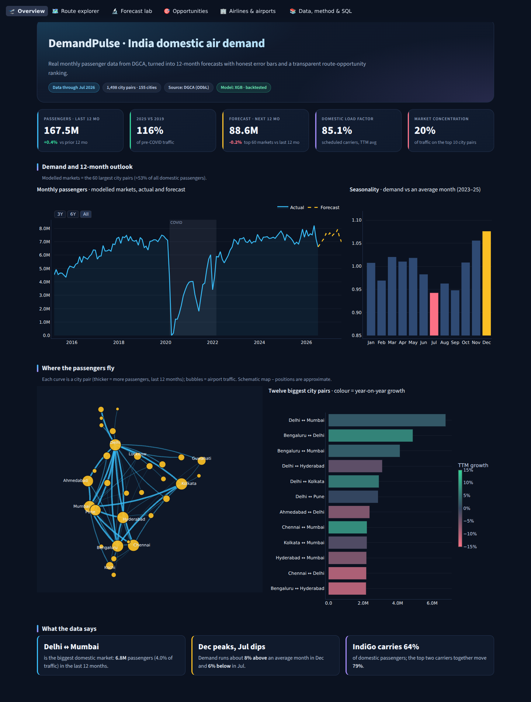
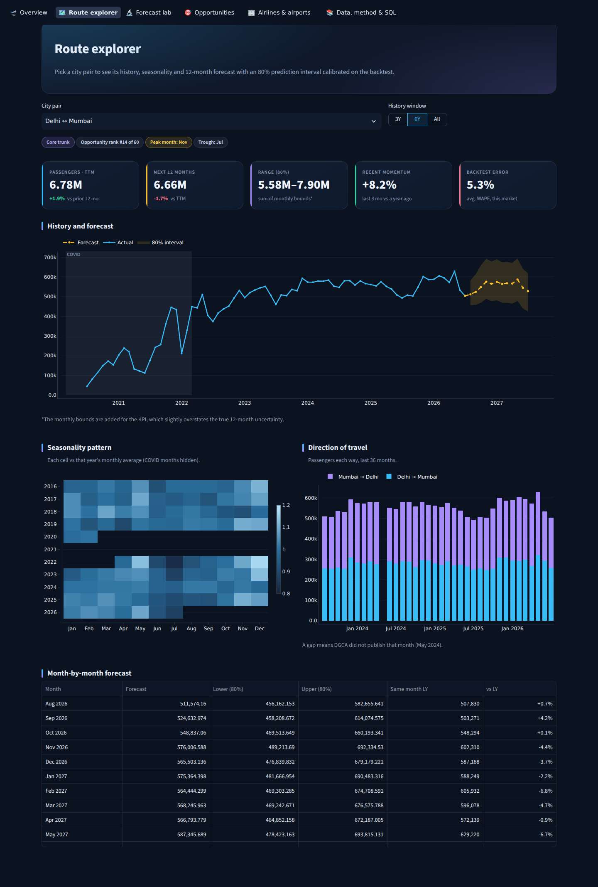
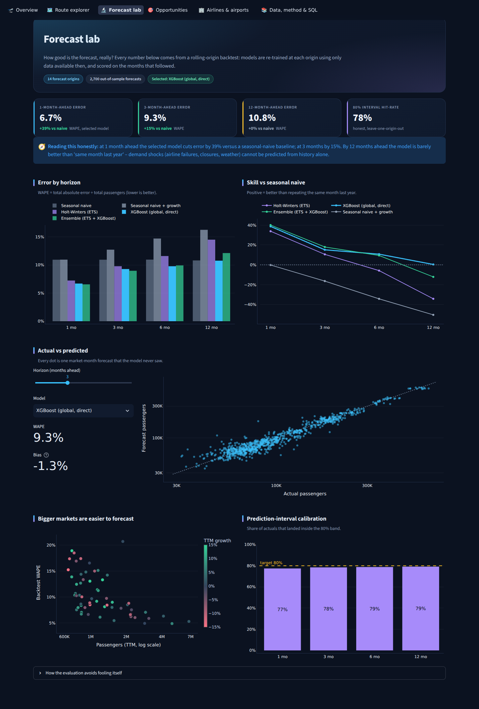
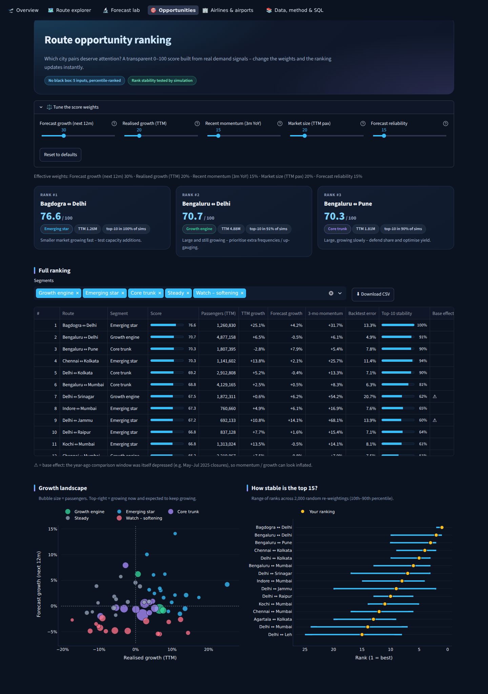
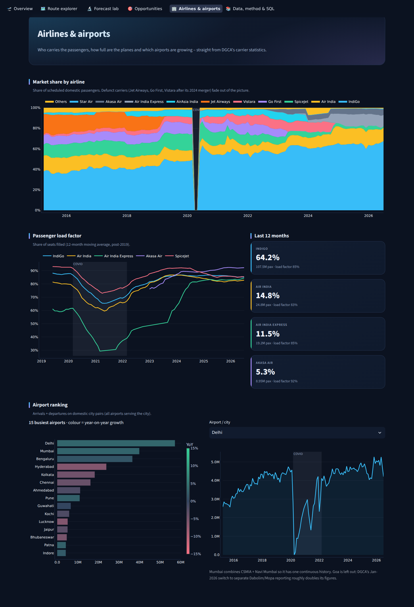

# ✈️ DemandPulse — India domestic air-demand forecasting & route-opportunity analytics

Real DGCA passenger data → clean city-pair panel → honestly-backtested 12-month forecasts with prediction intervals →
a transparent, re-weightable **Route Opportunity Score** → an interactive Streamlit dashboard and a SQL layer.




## What makes this different from a typical forecasting demo
- **100 % real data.** 134 months (Apr-2015 → Jul-2026) of DGCA monthly domestic traffic for ~1,500 city pairs, plus carrier load factors.
- **Independent validation.** City-pair totals reconcile with DGCA's separate carrier totals (median gap 0.000 %, worst month 0.63 %).
- **Real-world data engineering.** Airport re-labelling/splitting (Mumbai, Goa, Ayodhya, Visakhapatnam …) fixed so every city has one history; two months DGCA never published are estimated and flagged; a Goa reporting break is detected and excluded rather than forecast.
- **Honest evaluation.** Rolling-origin backtest (14 origins, ~2,700 out-of-sample forecasts) at 1/3/6/12 months against a seasonal-naive baseline — and the README tells you where the model does **not** help.
- **Calibrated uncertainty.** 80 % intervals from backtest residuals, checked leave-one-origin-out (77–79 % actual coverage).
- **No fake capacity story.** DGCA publishes no route-level seats or fares, so the score ranks *demand attractiveness* — it does not pretend to measure a capacity gap or revenue.

## Results (from the real data)
| Model (WAPE, lower = better) | 1 mo | 3 mo | 6 mo | 12 mo |
|---|---|---|---|---|
| Seasonal naive (baseline) | 10.9 % | 10.9 % | 11.0 % | 10.8 % |
| Holt-Winters ETS | 7.2 % | 9.8 % | 11.6 % | 14.5 % |
| **XGBoost (global, direct multi-horizon) – selected** | **6.7 %** | **9.3 %** | **9.8 %** | **10.8 %** |
| Ensemble (ETS + XGBoost) | 6.6 % | 9.0 % | 9.9 % | 12.1 % |

The selected model beats the baseline by **39 % at 1 month, 15 % at 3 months, 11 % at 6 months — and by essentially nothing at 12 months**.
Long-range demand is dominated by shocks (airline failures, closures) that history cannot predict.

**Headline findings:** 167.5 M passengers in the last 12 months (+0.4 % YoY); 2025 traffic = 116 % of 2019; the top 10 city pairs carry 20 % of
traffic; December peaks (+8 %) and July is the trough (−6 %); IndiGo carries 64 % of passengers; scheduled-domestic load factor averages 85 %.
Full auto-generated report: [`outputs/reports/insights.md`](outputs/reports/insights.md).

## Dashboard
| | |
|---|---|
|  **Route explorer** – history, 80 % band, seasonality heat-map |  **Forecast lab** – model comparison, calibration |
|  **Opportunities** – live re-weighting, stability |  **Airlines & airports** – share, load factor |

## Quick start
```bash
# Windows                       # macOS / Linux
setup.bat                       ./setup.sh
run_dashboard.bat               source .venv/bin/activate && streamlit run dashboard/app.py
```
Outputs are already included, so `pip install -r requirements.txt && streamlit run dashboard/app.py` works immediately.
Re-run everything (~1 min) with `python run_pipeline.py`; pull the newest DGCA data first with `python run_pipeline.py --refresh-data`.
Run the tests with `pytest` (35 tests, a few seconds). To deploy free on Streamlit Community Cloud, set the main file to `dashboard/app.py`.

## How it works
```
data/raw (DGCA)  ─►  ingest.py  ─►  market panel (60 largest city pairs, complete post-COVID history)
                                    │
                   backtest.py ◄────┤  5 models × 4 horizons, expanding-window, rolling origin
                        │           │
                   forecast.py ◄────┘  12-month forecast + backtest-calibrated 80 % intervals
                        │
                 opportunity.py  ─►  0–100 score, segments, rank-stability simulation
                        │
              db.py (SQLite) + insights.py  ─►  dashboard/ (Streamlit + Plotly)
```
- **Models:** seasonal naive, seasonal naive + growth, damped-trend multiplicative Holt-Winters (fitted post-COVID only), a *global direct multi-horizon* XGBoost (one model per horizon predicting `y[t+h]/level_t` from 13 look-back ratios, 3-month YoY, national momentum, calendar month), and an ETS+XGBoost ensemble. The model with the lowest mean WAPE is selected automatically.
- **COVID:** any training sample whose look-back window or target touches Mar-2020 → Mar-2022 is dropped.
- **Leakage tests:** a unit test rewrites every value after a forecast origin and asserts that origin's features do not change.
- **Opportunity score:** percentile-ranked blend of forecast growth (30 %), realised TTM growth (20 %), 3-month momentum (15 %), market size (20 %), forecast reliability (15 %). Weights are editable in the app; ranking stability is checked with 2,000 random re-weightings. Markets whose year-ago comparison window was itself disrupted (e.g. May–Jul 2025 closures on Jammu/Srinagar/Leh routes) are flagged ⚠.
- **SQL:** `sql/analysis_queries.sql` holds 8 window-function queries (YoY with `LAG`, shares with `SUM() OVER`, ranking with `RANK/DENSE_RANK`, recovery vs 2019 …). All run in the app's read-only SQL explorer.

## Project layout
```
run_pipeline.py            one-command pipeline          dashboard/app.py        Streamlit entry point
src/demandpulse/           ingest · models · backtest · forecast · opportunity · db · insights · geo · config
dashboard/views/           overview · route_explorer · forecast_lab · opportunities · market · about
sql/analysis_queries.sql   named analytical queries      tests/                  35 pytest tests
data/raw · data/processed  inputs and cleaned tables     outputs/                forecasts, backtest, reports
```

- **Passengers ≠ demand.** Traffic is capped by seats; strong routes may be under-counted when flights are full.
- **No fares, seats or schedules** at route level → no revenue or capacity-gap analysis.
- **City pairs, domestic only.** Connecting passengers and international traffic are not modelled.
- **Shocks are unforecastable**, and they distort year-on-year comparisons for a year afterwards (see ⚠ flags).
- The backtest window (Apr-2024 →) is short and contains real disruptions; errors are realistic, not flattering.
- The map is schematic (no basemap), city positions are approximate.

# 👩‍💻 Author

**Deepika Rai**\
Final Year B.Tech student Computer Science & Engineering (Data Science)

-   GitHub: https://github.com/deepikarai069
-   LinkedIn: https://linkedin.com/in/deepika-rai

------------------------------------------------------------------------

## ⭐ Built for real-world decision support

An end-to-end Data Analytics + Forecasting portfolio project focused on
turning messy aviation data into validated forecasts and actionable
route intelligence.
